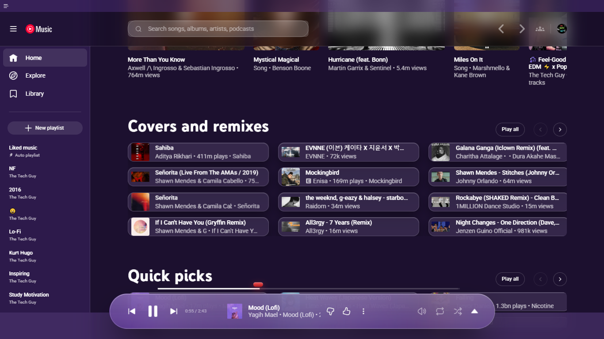
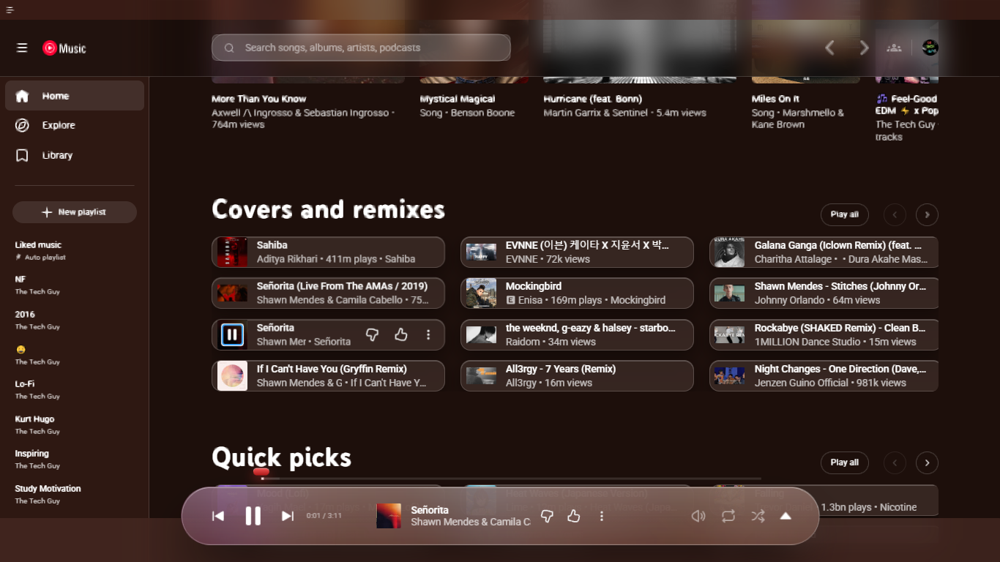
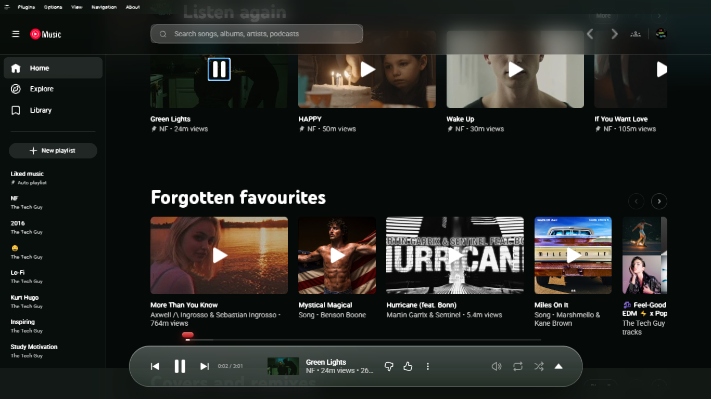
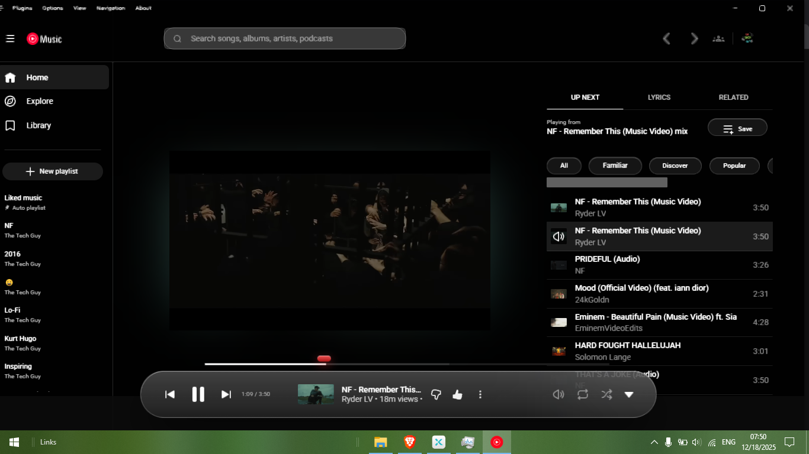
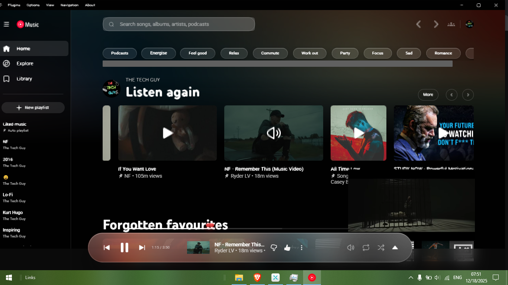

# 🍏 Liquid Glass Theme  - Pear Desktop 

A custom **Liquid Glass CSS theme** for Pear Desktop.

---

## Preview

---

## Installation

1. Open **Pear Desktop**
2. Click **Options** (top left)
3. Go to **Visual Tweaks**
4. Open **Themes**
5. Select **Import Custom CSS**
6. Choose the downloaded `theme.css` file
7. Apply and restart if required

> ⚠️ Performance may vary depending on your system specifications.  
> More stable and updated versions of the theme will be released soon.

---

## Credits

- Thanks to the **Pear Desktop developers** for creating this amazing platform:  
  [Official Pear Desktop GitHub](https://github.com/pear-devs/pear-desktop)

- Theme designed and created by **Chamod Yoshitha** :  
  [Chamod GitHub](https://github.com/chamodyoshi123)

---

## Support

If you like this theme and want to support my work, you can buy me a coffee here:  
[Buy Me a Coffee](https://www.buymeacoffee.com/chamodyosht)

---

## License

This theme is free for **personal use only**.

You may:
- Use this theme on your own Pear Desktop installation

You may NOT:
- Sell this theme
- Re-upload, redistribute, or share it publicly
- Remove or alter the author credit

© 2025 Chamod Yoshitha Dissanayaka. All rights reserved.
